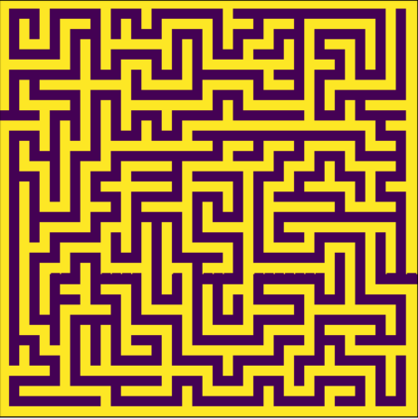
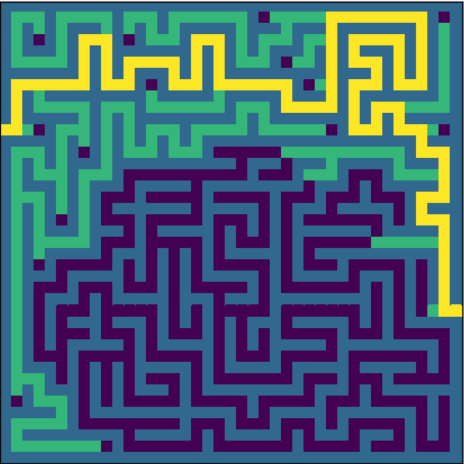

# MazeSolver
Maze solver and simple visualizer in python with A* and BFS algorithm  

MazeSolver solves mazes, which are manually read and interpreted from text file to 2D array.

# Creating a maze

# Solving a maze
example from xLarge.txt with BFS.

